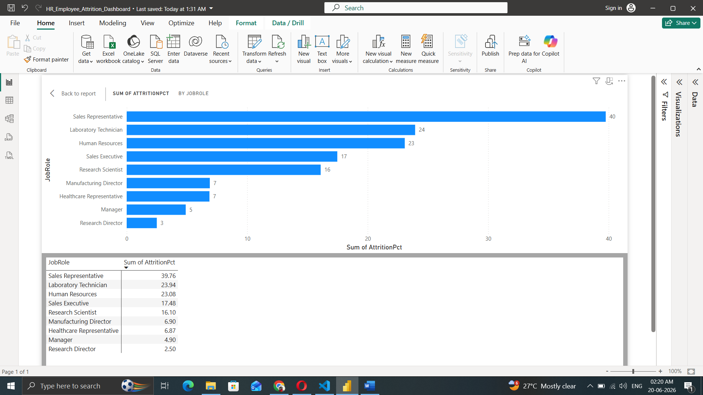

# HR Employee Attrition Analysis | SQL + Power BI

**Analyzed 1,470 employees to identify high-risk departments and roles driving attrition**

Completed: June 20, 2026  
Tools: `SQL - SQLite` | `Power BI` | `DAX` | `Data Modeling`

### Business Problem
Reduce attrition by identifying which departments, roles, and demographics are at highest risk.

### Key Insights
- **Sales Representative: 39.76% attrition** vs Company Avg 16.12% → 2.5x higher risk
- **Sales Dept paradox**: Highest avg salary 6.9K but 20.6% attrition vs R&D 13.9%
- **Low Job Satisfaction 1-2: 48.3% attrition** → Engagement is critical
- **Single employees: 35.1% attrition** vs Married: 20.2%

### Business Impact & Recommendations
1. **Target Sales retention**: Career growth + bonus programs for Sales Rep role
2. **Compensation review**: High pay isn’t enough - address Sales dept culture
3. **Engagement focus**: Surveys/interventions for low satisfaction scores

### Project Files
- `HR_Employee_Attrition_Dashboard.pbix` - Interactive Power BI dashboard
- `FULL_DASHBOARD_HR_ATTRITION.png` - Full dashboard screenshot
- `Attrition_By_Department.png`, `Attrition_By_JobRole.png`, `Salary_By_Department.png` - Key Power BI visuals
- `KPI_01_HedCount.sql` to `KPI_08_AvgSalaryByDept.sql` - 8 SQL queries with outputs
- `KPI_01_HeadCount_Output.png` to `KPI_08_AvgSalaryByDept_Output.png` - SQL KPI results
- `HR_Employee_Attrition_Dashboard.pdf` - PDF export
- `Ankita_Kundu_DataAnalyst.pdf` - Resume

### How I Built This
1. **SQL**: Built 8 KPIs covering Headcount, Attrition by Dept/Role/Gender/Age/Tenure, Avg Salary
2. **Power BI**: Created data model + DAX measures for Retention Rate and Attrition Risk Score
3. **Insights**: Translated data into 3 actionable HR recommendations
